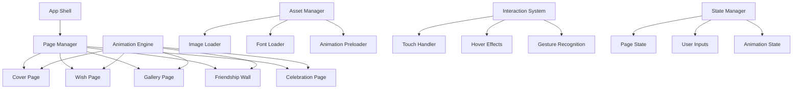

# Design Document: Interactive Birthday-Wish Website

## Overview

The Interactive Birthday-Wish Website is a premium digital greeting card experience that combines the emotional impact of a physical card with modern web interactivity. The system is architected as a single-page application with five distinct experiential phases: Cover, Wish, Gallery, Friendship Wall, and Celebration. Each phase features carefully crafted animations, premium visual design, and tactile interactions optimized for mobile-first usage.

The design emphasizes emotional connection through handcrafted visual elements, smooth animations, and personalized content while maintaining technical excellence with 60fps performance and responsive layouts.

## Architecture

### System Architecture

The application follows a component-based architecture with clear separation of concerns:



### Core Components

**App Shell**: Manages the overall application lifecycle, preloading, and global state
**Page Manager**: Handles navigation between the five experiential phases with smooth transitions
**Animation Engine**: Centralized system for managing all visual effects, transitions, and performance optimization
**Asset Manager**: Handles loading and optimization of images, fonts, and animation assets
**Interaction System**: Processes user inputs and translates them into appropriate visual feedback
**State Manager**: Maintains application state including user-generated content and animation states

## Components and Interfaces

### Page Components

#### Cover Page Component
```typescript
interface CoverPageProps {
  onOpen: () => void;
  sparkleIntensity: number;
  butterflyCount: number;
}

interface CoverPageState {
  isAnimating: boolean;
  hingeRotation: number;
  sparklePositions: Point[];
}
```

**Responsibilities:**
- Render premium greeting card visual with glassmorphism effects
- Handle "Tap to Open" interaction with 3D page-turn animation
- Manage decorative elements (sparkles, butterflies, ribbons)
- Trigger transition to Wish Page

#### Wish Page Component
```typescript
interface WishPageProps {
  message: string;
  handwritingFont: string;
  gradientColors: string[];
}

interface WishPageState {
  textRevealProgress: number;
  doodleVisibility: boolean[];
  shimmerActive: boolean;
}
```

**Responsibilities:**
- Display handwriting-style birthday message with typewriter reveal effect
- Render glassmorphism cards with soft pastel gradients
- Show micro doodles as decorative elements
- Handle hover interactions with shimmer effects

#### Gallery Component
```typescript
interface GalleryProps {
  photos: Photo[];
  scrapbookTextures: Texture[];
}

interface Photo {
  id: string;
  src: string;
  alt: string;
  hiddenMessage: string;
  polaroidRotation: number;
}

interface GalleryState {
  selectedPhoto: string | null;
  messageRevealed: boolean[];
  staggerAnimationProgress: number;
}
```

**Responsibilities:**
- Display photos in Polaroid frames with scrapbook styling
- Handle click-to-reveal interactions for hidden messages
- Manage stagger fade animations
- Apply portrait cutout and framing effects

#### Friendship Wall Component
```typescript
interface FriendshipWallProps {
  initialNotes: StickyNote[];
  maxUserNotes: number;
}

interface StickyNote {
  id: string;
  content: string;
  color: string;
  position: Point;
  rotation: number;
  isPinned: boolean;
  isUserGenerated: boolean;
}

interface FriendshipWallState {
  notes: StickyNote[];
  draggedNote: string | null;
  shuffleAnimation: boolean;
}
```

**Responsibilities:**
- Display existing sticky notes with pin-down animations
- Handle user input for creating new thoughts
- Manage dragging and repositioning interactions
- Apply shuffle effects and varied orientations

#### Celebration Page Component
```typescript
interface CelebrationPageProps {
  balloonCount: number;
  confettiDensity: number;
  celebrationMessage: string;
}

interface CelebrationState {
  particleSystem: ParticleSystem;
  balloonPositions: Point[];
  glowIntensity: number;
  animationLoop: boolean;
}
```

**Responsibilities:**
- Render animated balloons, confetti, and sparkles
- Display glowing typography for celebration messages
- Manage looping celebratory animations at 60fps
- Handle particle system lifecycle

### Animation System

#### Animation Engine
```typescript
interface AnimationEngine {
  registerAnimation(id: string, animation: Animation): void;
  playAnimation(id: string, options?: AnimationOptions): Promise<void>;
  pauseAnimation(id: string): void;
  stopAnimation(id: string): void;
  setGlobalFPS(fps: number): void;
}

interface Animation {
  duration: number;
  easing: EasingFunction;
  keyframes: Keyframe[];
  loop?: boolean;
  stagger?: StaggerConfig;
}

interface StaggerConfig {
  delay: number;
  direction: 'forward' | 'reverse' | 'center-out';
  overlap: number;
}
```

**Key Animations:**
- **Page Turn**: 3D rotation with hinge effect (800ms, ease-out)
- **Stagger Fade**: Sequential reveal with motion blur (1200ms, ease-in-out)
- **Elastic Scale**: Bounce effect for interactions (300ms, elastic)
- **Shimmer**: Subtle highlight sweep (600ms, linear, loop)
- **Particle Systems**: Continuous confetti and sparkle effects

### Visual Design System

#### Color Palette
```typescript
interface ColorPalette {
  primary: {
    pink: '#FFB6C1';
    lavender: '#E6E6FA';
    nude: '#F5DEB3';
    cream: '#FFFDD0';
    pearlWhite: '#F8F6F0';
  };
  accents: {
    neonPink: '#FF1493';
    neonLavender: '#DA70D6';
    gold: '#FFD700';
  };
  gradients: {
    sunset: 'linear-gradient(135deg, #FFB6C1, #E6E6FA)';
    pearl: 'linear-gradient(45deg, #F8F6F0, #FFFDD0)';
    celebration: 'radial-gradient(circle, #FF1493, #DA70D6)';
  };
}
```

#### Typography System
```typescript
interface TypographySystem {
  fonts: {
    serif: 'Playfair Display'; // Titles and headers
    sansSerif: 'Inter'; // Body text and UI
    handwriting: 'Dancing Script'; // Personal messages
  };
  scales: {
    mobile: {
      h1: '2.5rem';
      h2: '2rem';
      body: '1rem';
      caption: '0.875rem';
    };
    desktop: {
      h1: '3.5rem';
      h2: '2.75rem';
      body: '1.125rem';
      caption: '1rem';
    };
  };
}
```

#### Glassmorphism Effects
```typescript
interface GlassmorphismStyle {
  background: 'rgba(255, 255, 255, 0.25)';
  backdropFilter: 'blur(10px)';
  border: '1px solid rgba(255, 255, 255, 0.18)';
  borderRadius: '16px';
  boxShadow: '0 8px 32px 0 rgba(31, 38, 135, 0.37)';
}
```

## Data Models

### Application State
```typescript
interface AppState {
  currentPage: PageType;
  isLoading: boolean;
  assetsLoaded: boolean;
  userPreferences: UserPreferences;
  sessionData: SessionData;
}

enum PageType {
  COVER = 'cover',
  WISH = 'wish',
  GALLERY = 'gallery',
  FRIENDSHIP_WALL = 'friendship_wall',
  CELEBRATION = 'celebration'
}
```

### User-Generated Content
```typescript
interface UserPreferences {
  reducedMotion: boolean;
  audioEnabled: boolean;
  touchSensitivity: number;
}

interface SessionData {
  userNotes: StickyNote[];
  visitedPages: PageType[];
  interactionCount: number;
  sessionStartTime: number;
}
```

### Asset Models
```typescript
interface PhotoAsset {
  id: string;
  originalSrc: string;
  optimizedSrc: string;
  thumbnailSrc: string;
  dimensions: { width: number; height: number; };
  alt: string;
  hiddenMessage: string;
}

interface AnimationAsset {
  id: string;
  type: 'lottie' | 'css' | 'canvas';
  src: string;
  duration: number;
  loop: boolean;
  preload: boolean;
}
```

## Correctness Properties

*A property is a characteristic or behavior that should hold true across all valid executions of a system—essentially, a formal statement about what the system should do. Properties serve as the bridge between human-readable specifications and machine-verifiable correctness guarantees.*

Before writing the correctness properties, let me analyze the acceptance criteria to determine which ones are testable as properties.

<function_calls>
<invoke name="prework">
<parameter name="featureName">birthday-wish-website

Based on the prework analysis, I'll now convert the testable acceptance criteria into correctness properties:

### Property 1: Cover Interaction Triggers Page Turn
*For any* user interaction (tap or click) on the cover page, the website should trigger a 3D page-turn animation with hinge effect and transition to the wish page upon completion.
**Validates: Requirements 1.2, 1.4**

### Property 2: Photo Click Reveals Hidden Messages  
*For any* photo in the gallery, clicking on it should reveal its associated hidden message with stagger fade animation effects.
**Validates: Requirements 3.2**

### Property 3: Sticky Note Interaction Consistency
*For any* sticky note on the friendship wall, users should be able to drag and reposition it, and newly added notes should appear with shuffle effects.
**Validates: Requirements 4.2, 4.3**

### Property 4: Session Data Persistence
*For any* user-generated content (sticky notes, customizations), the data should persist throughout the current session and remain available after navigating between pages.
**Validates: Requirements 4.4, 9.3**

### Property 5: Animation Performance Consistency
*For any* animation or interactive element, the website should maintain 30-60fps performance during playback, including celebration animations, page transitions, and hover effects.
**Validates: Requirements 5.4, 7.4, 10.2**

### Property 6: Glassmorphism Visual Effects
*For any* UI element requiring glassmorphism styling (cover, wish cards, gallery frames), the website should apply consistent backdrop blur, transparency, and soft shadow effects.
**Validates: Requirements 1.5, 2.2, 6.2**

### Property 7: Decorative Elements Presence
*For any* page or component, the website should display appropriate decorative elements (sparkles, butterflies, ribbons, doodles, bokeh) that match the page's theme and aesthetic.
**Validates: Requirements 1.3, 2.3, 6.4**

### Property 8: Hover Effect Responsiveness
*For any* interactive element, hovering should trigger appropriate micro-animations (shimmer, wobble, elastic scaling) that provide visual feedback.
**Validates: Requirements 2.4, 7.1, 7.3**

### Property 9: Typography System Consistency
*For any* text content, the website should apply the correct font family based on content type (serif for titles, sans-serif for body, handwriting for wishes).
**Validates: Requirements 6.3**

### Property 10: Color Palette Adherence
*For any* visual element, the website should use only colors from the defined pastel palette (pink, lavender, nude, cream, pearl white) with neon accents.
**Validates: Requirements 6.1**

### Property 11: Responsive Layout Adaptation
*For any* viewport size change, the website should maintain proper spacing, typography scaling, and element sizing while preserving visual hierarchy and accessibility.
**Validates: Requirements 2.5, 8.2, 8.4**

### Property 12: Touch Accessibility Compliance
*For any* interactive element on touch devices, the website should provide adequate touch target sizes and maintain accessibility standards.
**Validates: Requirements 8.3**

### Property 13: Animation Loop Continuity
*For any* looping animation (celebration particles, sparkles), the website should seamlessly restart the animation cycle without interruption or visual glitches.
**Validates: Requirements 5.3, 5.5**

### Property 14: Page Transition Consistency
*For any* navigation between pages, the website should use keyframe stagger animations with motion blur and Alight Motion inspired effects.
**Validates: Requirements 7.2, 7.5**

### Property 15: Content Customization Preservation
*For any* customized content (photos, messages), the website should maintain all styling, animations, and visual effects while validating and optimizing the content for web display.
**Validates: Requirements 9.1, 9.2, 9.4**

### Property 16: Cross-Browser Compatibility
*For any* supported browser, the website should implement modern web technologies that ensure consistent functionality and visual appearance.
**Validates: Requirements 10.5**

### Property 17: Asset Optimization Efficiency
*For any* image or asset, the website should optimize file sizes for fast loading while preserving visual quality and meeting performance targets.
**Validates: Requirements 10.4**

### Property 18: Loading Performance Standards
*For any* initial page load on standard mobile connections, the website should display the cover page within 3 seconds.
**Validates: Requirements 10.1**

### Property 19: Visual Styling Consistency
*For any* page or component, the website should maintain consistent premium aesthetic, scrapbook textures, Polaroid frames, and styling effects regardless of content variations.
**Validates: Requirements 3.3, 3.5, 6.5, 9.5**

### Property 20: Animation Quality Preservation
*For any* device or screen size, the website should preserve animation quality and performance while adapting to different hardware capabilities.
**Validates: Requirements 8.5, 10.3**

## Error Handling

### Animation Fallbacks
- **Reduced Motion**: Detect `prefers-reduced-motion` and provide static alternatives
- **Performance Degradation**: Automatically reduce animation complexity if frame rate drops below 30fps
- **Asset Loading Failures**: Display placeholder content while retrying asset loads
- **Browser Compatibility**: Graceful degradation for unsupported CSS features

### User Input Validation
- **Image Upload**: Validate file types (JPEG, PNG, WebP), size limits (5MB max), and dimensions
- **Sticky Note Content**: Sanitize user input, limit character count (280 chars), prevent XSS
- **Touch Gestures**: Handle edge cases for simultaneous touches and gesture conflicts

### Performance Monitoring
- **Frame Rate Tracking**: Monitor animation performance and adjust quality dynamically
- **Memory Management**: Cleanup unused animations and assets to prevent memory leaks
- **Network Conditions**: Adapt asset loading strategy based on connection speed

### Accessibility Considerations
- **Screen Readers**: Provide appropriate ARIA labels and descriptions for visual elements
- **Keyboard Navigation**: Ensure all interactive elements are keyboard accessible
- **Color Contrast**: Maintain WCAG AA compliance for text readability
- **Focus Management**: Clear focus indicators and logical tab order

## Testing Strategy

### Dual Testing Approach

The testing strategy employs both unit tests and property-based tests to ensure comprehensive coverage:

**Unit Tests** focus on:
- Specific examples and edge cases (empty states, error conditions)
- Integration points between components
- Browser-specific behavior verification
- Accessibility compliance validation

**Property-Based Tests** focus on:
- Universal properties that hold across all inputs
- Animation performance under various conditions
- Responsive behavior across viewport ranges
- User interaction consistency

### Property-Based Testing Configuration

**Testing Library**: Fast-check for JavaScript/TypeScript property-based testing
**Test Configuration**: Minimum 100 iterations per property test to ensure thorough coverage
**Performance Testing**: Custom performance monitoring utilities for frame rate measurement

Each property test must reference its corresponding design document property using the tag format:
**Feature: birthday-wish-website, Property {number}: {property_text}**

### Test Categories

**Visual Regression Tests**:
- Screenshot comparison for consistent styling
- Animation keyframe verification
- Color palette compliance checking

**Performance Tests**:
- Frame rate monitoring during animations
- Load time measurement under various network conditions
- Memory usage tracking during extended sessions

**Interaction Tests**:
- Touch gesture recognition accuracy
- Hover effect responsiveness
- Drag and drop functionality validation

**Accessibility Tests**:
- Screen reader compatibility
- Keyboard navigation flow
- Color contrast verification
- Touch target size validation

### Testing Environment Setup

**Browser Matrix**: Chrome, Firefox, Safari, Edge (latest 2 versions)
**Device Testing**: iPhone 12/13/14, iPad, Android devices (Samsung Galaxy S21+)
**Network Simulation**: 3G, 4G, WiFi conditions for performance testing
**Accessibility Tools**: axe-core for automated accessibility testing

The testing strategy ensures that both the technical implementation and user experience meet the premium quality standards expected for this emotional, personal website experience.